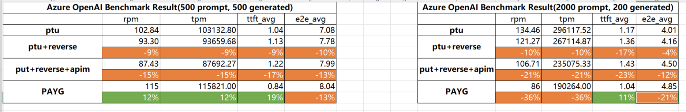

# OpenAI Proxy for Azure

A centralized monitoring solution for OpenAI services based on Yarp's high-performance gateway, capable of real-time token usage statistics and load balancing.

### OpenAI Service Challenges

- OpenAI service temporarily lacks native split-billing function
- Unable to monitor the usage of different applications of OpenAI instances
- Unable to limit the request frequency per application

### Our Solution

- Implement centralized OpenAI service management and monitoring
- Dynamically distribute requests, optimizing OpenAI Quota usage
- Integrate AAD identity authentication and access control, protecting OpenAI services
- Real-time analysis of user/department usage for cost allocation
- Support dynamic flow control of TPM/RPM, enhancing the user experience of PTU/PAYG/Mixed mode
- Support OpenAI Stream mode fully, improving response speed
- Fully compatible with client sdk, no need to change code
- [Support Circuit Breaker mode with Azure APIM](https://techcommunity.microsoft.com/blog/fasttrackforazureblog/using-azure-api-management-circuit-breaker-and-load-balancing-with-azure-openai-/4041003)

### Architecture

### Performance Result

Manually calculating text and image tokens in streaming mode (context/generation) can have a side effect on performance.

Below are benchmark results in non-streaming mode comparing the performance of the Azure OpenAI PTU with this proxy and a pay-as-you-go instance.

In steaming mode, no delay in first token return time.

* Benchmark tool:  [azure-openai-benchmark](https://github.com/Azure/azure-openai-benchmark)

#### In conclusion: 

The price of enhanced monitoring is a certain degree of performance degradation, please balance performance and monitorability with your business scenario.
